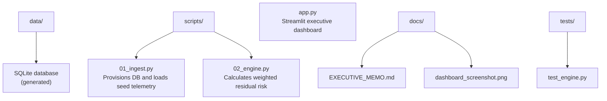

# Enterprise Risk Engine (ERM-X)

A working prototype demonstrating unified risk telemetry, business impact quantification, and Agentic AI governance for NYC's payroll and financial systems.

## 🎯 Purpose

This project normalizes disparate risk sources (cloud, vendor, vulnerability, AI) and weights them against mission-critical services.


## 🏗️ Architecture




## Quick Start

```bash
git clone https://github.com/hibdiop/fisa-erm-x.git
cd fisa-erm-x
python -m venv venv
source venv/bin/activate  # or venv\Scripts\activate on Windows
pip install -r requirements.txt
python scripts/01_ingest.py
<<<<<<< HEAD
streamlit run app.py# fisa-erm-x
```


=======
streamlit run app.py

```


Key Finding
An autonomous AI agent with write-access to the payroll ledger scores 12.00 / 15.0 — the highest enterprise risk in the portfolio. See docs/EXECUTIVE_MEMO.md for the Triple-Gate governance framework.


Tech Stack
- Python 3.10+
- SQLite3
- pandas
- Streamlit
- OWASP Top 10 for LLMs / NIST AI RMF (conceptual alignment)

